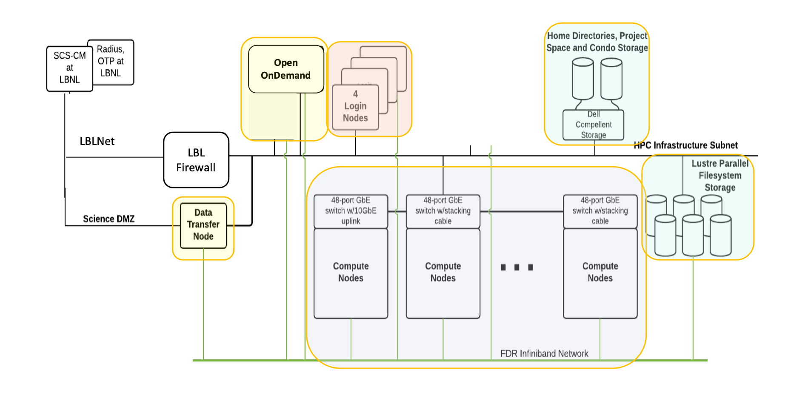
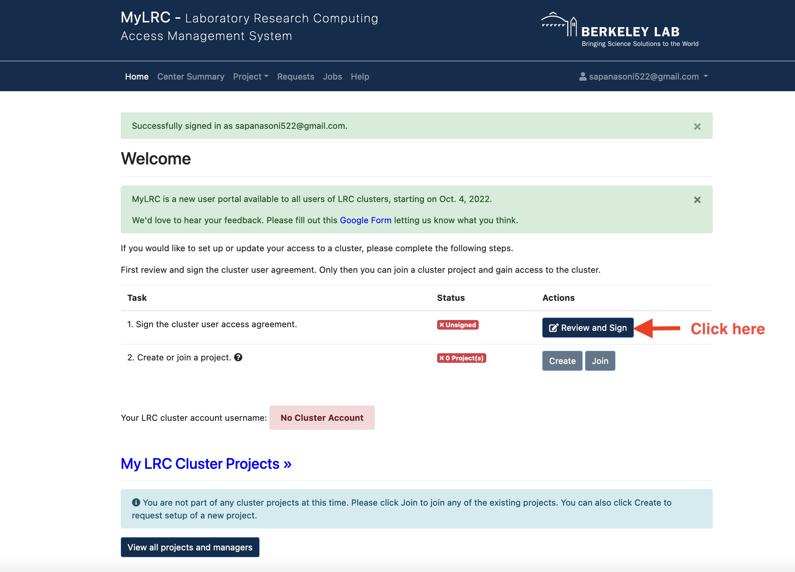
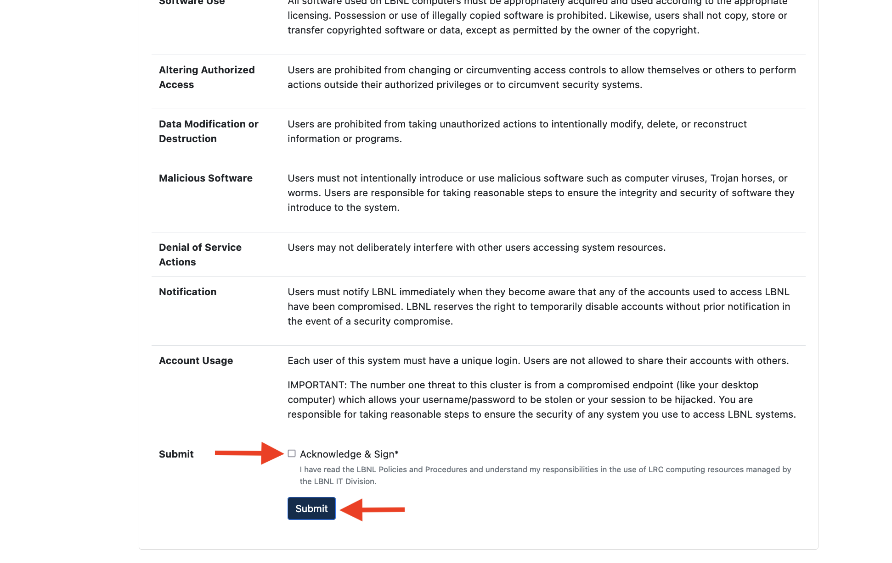
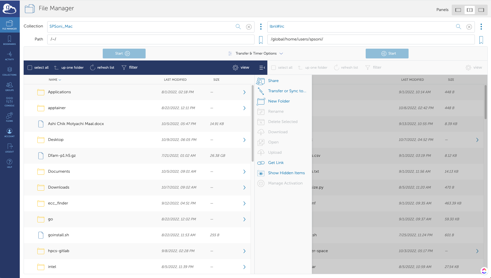

<style>section { font-size: 25px; }</style>
<style>
img[alt~="center"] {
  display: block;
  margin: 0 auto;
}
</style>

<!-- _class: lead -->
<!-- _paginate: false -->
# HPC services on Lawrencium Supercluster
### Sapana Soni
###### HPCS User Support Team


---

<style scoped>section { font-size: 28px; }</style>

<!-- paginate: true -->
# Outline
<style scoped>section { font-size: 26px; }</style>
1. [Overview of Lawrencium supercluster](#3)
2. [MyLRC User Portal : account and project management](#6)
3. [Open OnDemand Portal: GUI applications](#12)
4. [Globus : fast data transfer](#15)
5. [Software Module Farm: software packages available for researchers](#18)
6. [Slurm Job Scheduling: job submission and monitoring](#22)

---

## Overview of Lawrencium supercluster
<style scoped>section { font-size: 24px; }</style>

- A LBNL Condo Cluster Computing Program
  - Support researchers in all disciplines at the Lab
  - Significant investment by the IT division
  - Individual PIs buy in compute nodes and storage
  - Computational cycles are shared among all lawrencium users

- Lawrencium Compute Nodes
  - data center is housed in the building 50B
  - over 2350 compute nodes (~72620 CPU cores)
  - 224 GPU cards
  - 32 partitions, lr3, lr4, lr5,lr6,lr7, es1, cm1 ...
  - ~1700 user accounts 
  - 342 projects/groups

---

# Conceptual Diagram of Lawrencium


<style scoped>section { font-size: 20px; }</style>
[Detailed Information of Lawrencium](https://it.lbl.gov/service/scienceit/high-performance-computing/)


---
## Quick Poll: 
### Check the poll question and choose your answer.

----

### MyLRC User portal: https://mylrc.lbl.gov/

  A portal for user and project accounts requests and their management [MyLRC portal](https://mylrc.lbl.gov/)


For more details see previous training [slides](https://github.com/lbnl-science-it/OOD_training_Feb2023.git) and [recording](https://drive.google.com/file/d/1YOFruybGu8i1xi8imHibyHiujIAymnrX/view?usp=share_link).  

---
Sign the user access agreement form for first time login



---

#### Project Accounts
- Three types of project accounts can be requested.   
  1. **Primary Investigator (PI) Computing Allowance (PCA) account**: free 300K service units (SUs) per year (pc_xxx)
  2. **Condo account**: PIs buy in compute nodes to be added to the general pool, in exchange for their own priority access and share the Lawrencium infrastructure (lr_xxx)
  3. **Recharge account**: pay as you go with minimal recharge rate ~ $0.01/SU (ac_xxx)
- Check out more details here. [Project Accounts](https://it.lbl.gov/resource/hpc/for-users/hpc-documentation/accounts/projects-accounts/)
- LBL affiliated PI can request project account at [MyLRC portal](https://mylrc.lbl.gov/)
- PIs can grant PCA/condo/recharge project access to researchers/students and external collaborators.

----

#### User Accounts
PIs can sponsor researchers/students and external collaborators for cluster accounts.
Account requests and approval will be done through [MyLRC portal](https://mylrc.lbl.gov/).
  
  **Current Workflow:**
  1. Set Up an account on MyLRC [portal](https://mylrc.lbl.gov/). Portal uses CILogon for user authentication. Users can register using the email address provided by LBNL or UC Berkeley or other institutions or google.
  2. Sign the User Access Agreement Form on the welcome page
  3. Request to join existing project
  4.  PI approval
  5.  Lawrencium account creation by HPCS team
  6. Users will receive a confirmation email and PIN+OTP set up instructions.
  
  Check out [documentation](https://it.lbl.gov/service/scienceit/high-performance-computing/mylrc-lawrencium-account-management-system/).


---

## Login to Lawrencium Cluster
<style scoped>section { font-size: 23px; }</style>
- Linux: Terminal (command-line) session.
- Mac: Terminal (see Applications -> Utilities -> Terminal).
- Windows: PowerShell, or [PuTTY](https://www.chiark.greenend.org.uk/~sgtatham/putty/latest.html) or [MobaXterm](https://mobaxterm.mobatek.net/download.html).
- One-time passwords (OTPs): set up Google Authenticator app on your smartphone or tablet [Instructions Here](https://it.lbl.gov/resource/hpc/for-users/hpc-documentation/connecting/multi-factor-authentication)
- Login:
    ```
    ssh $USER@lrc-login.lbl.gov 
    password:
    ```
- Password: your 4-digit PIN followed by 6-digit one-time password from your Google Authenticator. Example PIN: 0123 OTP: 456789. 
`
password:0123456789
`
Note: Characters won't appear on a screen in the password prompt when you enter in the digits.
**FAQ**: What if I forget my PIN? 
--> Reset PIN and test PIN+OTP [here](https://identity.lbl.gov/otptokens/login). 

----
## Login to Lawrencium Cluster
Upon login to Lawrencium, you'll end up on one of the login nodes in your home directory.
  ```
  spsoni@n0000 ~]$ hostname
  n0000.scs00
  [spsoni@n0000 ~]$ pwd
  /global/home/users/spsoni
  [spsoni@n0000 ~]$ 
  ```
### **DO NOT run jobs on login nodes!!**
  
----

## User Spaces

- Home: `/global/home/users/$USER/` 20GB per user, data is backed up, recommended for keeping scripts and final results data
- Global Scratch: `/global/scratch/users/$USER/`, shared, no backup, high performance Lustre parallel filesystem, recommended for keeping large data required for computation or generated after computation.
- Shared group project space
   - /global/home/groups-sw/  Size: 200GB, backup: YES
   - /global/home/group/ Size: 400GB,  backup: NO
- Condo Storage:
  - `e.g. /clusterfs/etna/ or /global/scratch/projects/xxx`

---
# Open OnDemand (OOD) Portal

- OpenOnDemand is a web platform that provides an easy access to the cluster’s HPC resourses and services.
- Designed and developed by Ohio Supercomputer Center.
- Intuitive and easy access to computing resourses, alternative and convenient way to traditional command line access
- Allow access to Lawrencium compute resources
  - File browser: file editing, data transfer
  - Shell command line access - terminal
  - Job monitoring 
- Interactive applications: Jupyter Server, RStudio Server, MATLAB, Desktop
- Sever: [https://lrc-ondemand.lbl.gov/](https://lrc-ondemand.lbl.gov/)
 

---

# Accessing OOD on Lawrencium

<style scoped>section { font-size: 25px; }</style>

 1. Web link to connect : [https://lrc-ondemand.lbl.gov/](https://lrc-ondemand.lbl.gov/)
**Note:** Use Chrome or Firefox to browse this page. Safari has known [authentication issues](https://osc.github.io/ood-documentation/master/issue/overview.html).


2.  Use your LRC username and PIN+one-time password (OTP)
    - same credentials you use to login Lawrencium cluster


---

### OOD Dashboard on Lawrencium 
On successful authentication you will see a OOD dashboard.


Lets do quick demo!
For more details see previous training [slides](https://github.com/lbnl-science-it/OOD_training_Feb2023.git) and [recording](https://drive.google.com/file/d/1YOFruybGu8i1xi8imHibyHiujIAymnrX/view?usp=share_link). 

---

## Globus : fast data transfer 
<style scoped>section { font-size: 22px; }</style>

- Globus can be used for fast data transfer and sharing with collaborators. Connect to globus  https://globus.lbl.gov  
- [Globus for Lawrencium](https://it.lbl.gov/resource/hpc/for-users/hpc-documentation/data-movement-and-storage/globus/)
- Berkeley Lab users can use Globus to transfer files in/out of their LBNL [Google drive](https://it.lbl.gov/resource/globus/globus-for-google-drive/).
- Possible endpoints include: lbnl#lrc, ucb#brc, your laptop/desktop, NERSC.
- Transfer data to/from your laptop (endpoint setup)
   - Create an endpoint on your machine using Globus Connect Personal [globus-connect-personal](https://www.globus.org/globus-connect-personal)
   - Run Globus Connect Pesonal on your local machine



---
<style scoped>section { font-size: 22px; }</style>

#### lrc-xfer.lbl.gov: Data Transfer Node (DTN)
- On Linux: scp/rsync
```
# Transfer file or directory from a local machine to Lawrencium
scp file-xxx $USER@lrc-xfer.lbl.gov:/global/home/users/$USER
scp -r dir-xxx $USER@lrc-xfer.lbl.gov:/global/scratch/users/$USER

# Transfer file or directory from Lawrencium to a local machine
scp $USER@lrc-xfer.lbl.gov:/global/scratch/users/$USER/file-xxx ~/Desktop
scp -r $USER@lrc-xfer.lbl.gov:/global/scratch/users/$USER/dir-xxx ~/Desktop

# Transfer directory from Lawrencium to Another Institute
ssh $USER@lrc-xfer.lbl.gov   # DTN
scp -r $USER@lrc-xfer.lbl.gov:/dir-on-lawrencium $USER@other-institute:/destination/path/$USER

rsync: a better data transfer or a backup tool
rsync -avpz file-at-local $USER@lrc-xfer.lbl.gov:/global/home/users/$USER
```
- On Window
  - [WinSCP](https://winscp.net/eng/index.php): SFTP client and FTP client for Microsoft Windows 
  - [FileZilla](https://filezilla-project.org/): multi-platform program via SFTP
---

### FileZilla
##### Site Manager (on the top right corner) 

<style scoped>section { font-size: 22px; }</style>
Click on connect to access Lawrencium for file transfer.
Enter your username and password (LRC credentials) in the pop-up window.
Once the connection is established, you are ready to drag and drop files to/from lawrencium.

---

## Software Module Farm: software packages availble for researchers 
<style scoped>section { font-size: 22px; }</style>

- Software stack, commonly used compiler, software tools are provided to all users through [software module farm on lawrencium](https://it.lbl.gov/resource/hpc/for-users/hpc-documentation/software-module-farm/)
- Installed and maintained on a centralized storage device and mounted as read-only NFS file system
   - Compilers: e.g. intel, gcc, MPI compilers, Python
   - Tools: e.g.matlab, singularity/apptainer, cuda
   - Applications: e.g. machine learning, QChem, MD, cp2k
   - Libraries: e.g. fftw, lapack

```
[spsoni@n0003 spsoni]$ module avail
-------------------------- /global/software/sl-7.x86_64/modfiles/langs ---------------------------
clang/11                  gcc/7.5.0                 perl/5.36.0
clang/3.9.1               gcc/11.3.0                python/3.9.12
 ...

---- /global/software/sl-7.x86_64/modfiles/tools ----
cmake/3.7.2   gnuplot/5.0.5    octave/4.2.0   matlab/r2017b(default)  ...

---- /global/software/sl-7.x86_64/modfiles/apps ----
bio/blast/2.6.0    math/octave/current    ml/tensorflow/2.5.0-py37 ...
...
```
----

## Environment Modules
<style scoped>section { font-size: 23px; }</style>
- Manages users’ software environment by dynamically setting up $PATH, $LD_LIBRARY_PATH…
- Avoid clashes between incompatible software versions

```  
module purge: clear user’s work environment
module available: check available software packages
module load packagename/version: load a package
module list: check currently loaded software
```
- Modules are arranged in a hierarchical fashion, some of the modules become available only after the parent module(s) are loaded
- e.g., MKL, FFT, and HDF5/NetCDF software is nested within the gcc module
- Example: load an OpenMPI package
```
module available openmpi mkl
module load intel/2016.4.072
module av openmpi
module load mkl/2016.4.072 openmpi/3.0.1-intel
```
---
# Software Installation

- Users can install software in their home, scratch or group space. Packages installed in group space are accessisble to all group memebers.
- Users don't have admin rights, but most software can be installed at custom path using 
` --prefix=/path/to/your/dir`

####  Installing Python Packages as an example case
- Python modules: abundantly available but cannot be installed in the default location without admin rights.
- `pip install --user package_name`
- `export PYTHONPATH=~/.local/lib/pythonX.X/site-packages/$PYTHONPATH`

---

```
[spsoni@n0000 ~]$ module load python/3.9.12
[spsoni@n0000 ~]$ python3 -m site --user-site
/global/home/users/spsoni/.local/lib/python3.9/site-packages
[spsoni@n0000 ~]$ pip install --user ml-python
...
Successfully built ml-python
Installing collected packages: ml-python
Successfully installed ml-python-2.2
[spsoni@n0000 ~]$ export PYTHONPATH=~/.local/lib/python3.9/site-packages/$PYTHONPATH
```
<style scoped>section { font-size: 23px; }</style>
- pip install: `--install-option="--prefix=$HOME/.local" package_name`
- Install from source code: `python setup.py install –-prefix=/home/user/package_dir`
- Create a virtual environmemt: `python -m venv my_env`
  - Activate environment: `source my_env/bin/activate`
  - Install packages into it: `python -m pip install <package-name>`
  - Deactivate  environment: `deactivate`
- Conda environment: `conda create -p /global/scratch/users/spsoni/my_env <package-name>`
  - Activate environment: `source activate /global/scratch/users/spsoni/my_env`
  - Deactivate environment: `conda deactivate`
---

##  Slurm Job Scheduling : submitting and monitoring jobs
SLURM is the resource manager and job scheduler for managing all the jobs on the cluster.

Why is this necessary?

- Prevent users' jobs running on the same nodes.
- Allow everyone to fairly share Lawrencium resources.

Basic workflow:
- login to Lawrencium; you'll end up on one of the login nodes in your home directory
- cd to the directory from which you want to submit the job (scratch recomended)
- submit the job using sbatch or an interactive job using srun (discussed later)
- SLURM assign compute node(s) to your jobs
- your jobs will run on a compute node, not the login node 


----
# Accounts, Partitions, Quality of Service (QOS)

Check slurm association, such as qos, account, partition, the information using following command. 

```
sacctmgr show association user=spsoni -p

Cluster|Account|User|Partition|Share|Priority|GrpJobs|GrpTRES|GrpSubmit|GrpWall|GrpTRESMins|MaxJobs|MaxTRES|MaxTRESPerNode|MaxSubmit|MaxWall|MaxTRESMins|QOS|Def QOS|GrpTRESRunMins|
perceus-00|pc_scs|spsoni|ood_inter|1||||||||||||lr_interactive|||
perceus-00|pc_scs|spsoni|lr6|1||||||||||||lr_debug,lr_lowprio,lr_normal|||
perceus-00|ac_test|spsoni|lr5|1||||||||||||lr_debug,lr_lowprio,lr_normal|||
perceus-00|pc_test|spsoni|lr4|1||||||||||||lr_debug,lr_lowprio,lr_normal|||
perceus-00|pc_test|spsoni|lr_bigmem|1||||||||||||lr_debug,lr_lowprio,lr_normal|||
perceus-00|lr_test|spsnoni|lr3|1||||||||||||condo_test|||
perceus-00|scs|spsnoni|es1|1||||||||||||es_debug,es_lowprio,es_normal|||
...
```
This information is required when submitting a job.
For Lawrencium cluster information click [here](https://it.lbl.gov/resource/hpc/lawrencium/)

----
#  Interactive Job Submission
<style scoped>section { font-size: 21px; }</style>

Interactive job submission is typically used for code debugging, testing, monitoring.

- **srun**: add your resource request to the queue.
- When the allocation starts, a new bash session will start up on one of the granted nodes

- `srun --account=ac_xxx --nodes=1 --partition=lr5 --qos=lr_normal --time=1:0:0 --pty bash`
- `srun -A ac_xxx -N 1 -p lr5 -q lr_normal -t 1:0:0 --pty bash`

```
[spsoni@n0003 ~]$ srun --account=scs --nodes=1 --partition=lr6 --time=1:0:0 --qos=lr_normal --pty bash
srun: Granted job allocation 28755918
srun: Waiting for resource configuration
srun: Nodes n0101.lr6 are ready for job
[spsoni@n0101 ~]$ squeue -u spsoni
             JOBID PARTITION     NAME     USER ST       TIME  NODES NODELIST(REASON)
          28755918       lr6     bash spsoni  R       0:14      1 n0101.lr6
```
Once you are on the assigned compute node, start application/commands directly

- **salloc**: allocate resources to run a job
- a new bash session will start up on the compute node, –pty gives you a pseudo terminal


----

# Node Features 
<style scoped>section { font-size: 23px; }</style>
Compute nodes may have different hardware within a SLURM partition, e.g. LR6 - lr6_sky: Intel Skylak, lr6_cas: Intel Cascade Lake, lr6_cas,lr6_m192: lr6_cas + 192GB RAM, lr6_sky,lr6_m192: lr6_sky + 192GB RAM 
- Lawrencium nodes features can be found [here](https://it.lbl.gov/resource/hpc/lawrencium/).
- wait time is longer when a specific type of node is requested
- Slurm flag: --constrain
```
[spsoni@n0000 ~]$ srun --account=scs --nodes=1 --partition=lr6 --time=1:0:0 --qos=lr_normal --constrain=lr6_sky --pty bash
[spsoni@n0081 ~]$ free -h
              total        used        free      shared  buff/cache   available
Mem:            93G        2.2G         83G        3.1G        7.4G         87G
Swap:          8.0G          0B        8.0G
[spsoni@n0081 ~]$ exit
exit
```

---
# Memory Specification 

- Most Lawrencium partitions are exclusive: a compute node allows only one user
- Some condo accounts or partitions, such as es1 (GPUs), each compute node can be shared by multiple users

- Slurm flag: --mem (MB) is required when using a shared partition:
- e.g. a compute node with 96GB RAM, 40 core node: 2300 RAM/core
  - `--ntask=1 --mem=2300` (request one core)
  - `--ntask=2 --mem=4600` (request 2 cores)

- LR6 partition lr_bigmem: two large memory nodes (1.5TB)
- Slurm flag: --partition=lr_bigmem
----

# Batch Job Submission
<style scoped>section { font-size: 21px; }</style>
- Get help with the complete command options `sbatch --help`
- sbatch: submit a job to the batch queue system `sbatch myjob.sh`
- Download batch job scripts [here](https://drive.google.com/drive/folders/1Dxuw90Qn84J060GxGVqwegR-1S00Mq7o?usp=sharing).
  
**myjob.sh** : Job submission script for serial job

```
#!/bin/bash
#SBATCH --job-name=mytest   # Job name
#SBATCH --partition=lr6     # Partition
#SBATCH --account=pc_test   # Account, replace it with your own account allocation
#SBATCH --qos=lr_normal     # qos
#SBATCH --time=1:00:00      # Wall clock time
#SBATCH --nodes=1           # Node count
#SBATCH --constrain=lr6_cas
#SBATCH --mail-user=xxx@lbl.gov
##SBATCH --mail-type=BEGIN/END/FAIL
#SBATCH --mail-type=ALL
# cd to your work directory
cd /your/dir
## Commands to run
module load python/3.9.12
python my.py >& mypy.out
```

----

## Do you want to accelerate computation to gaming speed??


**GPU**: Graphical Processing Units, **Image Credits**: [NVIDIA blog](https://blogs.nvidia.com/blog/2018/11/16/gpus-now-accelerate-almost-600-hpc-apps/)

<style scoped>section { text-align: justify; font-size: 22px;}</style> 
Common Scientific packages: GAMESS, NAMD, LAMMPS, GROMACS, Gaussian, VASP, Amber, GAMESS, Quantum Expresso, BLAST, ANSYS, LS-DYNA
Lawrencium cluster's **es1 partition** provides nodes with 2080Ti, V100 and A40 GPUs. 

----
## Submit Jobs to es1 GPU Partition
<style scoped>section { font-size: 18px; }</style>
- `--gres=gpu:type:GPU#`
- `--ntasks=CPU_CORE#`
- ratio CPU_CORE#:GPU# = 2:1

```
[spsoni@n0000 ~]$ srun -A scs -N 1 -p es1 --gres=gpu:1 --ntasks=2 -q es_normal -t 0:30:0 --pty bash
[spsoni@n0022 ~]$ nvidia-smi
Mon Oct 10 16:17:49 2022       
+-----------------------------------------------------------------------------+
| NVIDIA-SMI 460.84       Driver Version: 460.84       CUDA Version: 11.2     |
|-------------------------------+----------------------+----------------------+
| GPU  Name        Persistence-M| Bus-Id        Disp.A | Volatile Uncorr. ECC |
| Fan  Temp  Perf  Pwr:Usage/Cap|         Memory-Usage | GPU-Util  Compute M. |
|                               |                      |               MIG M. |
|===============================+======================+======================|
|   0  Tesla V100-SXM2...  Off  | 00000000:62:00.0 Off |                    0 |
| N/A   44C    P0    52W / 300W |      0MiB / 16160MiB |      0%      Default |
|                               |                      |                  N/A |
+-------------------------------+----------------------+----------------------+
|   1  Tesla V100-SXM2...  Off  | 00000000:89:00.0 Off |                    0 |
| N/A   43C    P0    54W / 300W |      0MiB / 16160MiB |      0%      Default |
|                               |                      |                  N/A |
+-------------------------------+----------------------+----------------------+
+-----------------------------------------------------------------------------+
| Processes:                                                                  |
|  GPU   GI   CI        PID   Type   Process name                  GPU Memory |
|        ID   ID                                                   Usage      |
|=============================================================================|
|  No running processes found                                                 |
+-----------------------------------------------------------------------------+
```
----
- Specify GPU type : --gres=gpu[*type*]:*count*

  - GRTX2080TI(GPU count = 3 or 4): --gres=gpu:GRTX2080TI:1
  - V100(GPU count = 2): --gres=gpu:V100:1
  - A40(GPU count = 4): --gres=gpu:A40:1
- In above example only one gpu is used but count can be set to total number of GPUs at the max.

```
[spsoni@n0000 ~]$ srun -A scs -N 1 -p es1 --gres=gpu:V100:2 --ntasks=4 -q es_normal -t 0:30:0 --pty bash

[spsoni@n0016 ~]$ nvidia-smi -L
GPU 0: Tesla V100-SXM2-16GB (UUID: GPU-7979861e-e0ad-000f-95fb-371e34593991)
GPU 1: Tesla V100-SXM2-16GB (UUID: GPU-50d24ac9-9eea-f96b-cc8b-db849f9c9427)

[spsoni@n0016 ~]$ echo $CUDA_VISIBLE_DEVICES
0,1
```

-----
## Submit A GPU Batch Job 

**myjob_gpu.sh**: Job Submission Script for GPUs

```
#!/bin/bash -l

#SBATCH --job-name=mytest
#SBATCH --partition=es1         ## es1 GPU partition
#SBATCH --account=pc_test
#SBATCH --qos=es_normal         ## qos of es1
#SBATCH --time=1:00:00
#SBATCH --nodes=1
#SBATCH --gres=gpu:V100:2       ## GPUs
#SBATCH --ntasks=4              ## CPU cores
#
#cd /your/dir
#Number of GPUs, this can be in the format of "gpu:[1-4]", or "gpu:V100:[1-2] with the type included

## Commands to run
module load ml/tensorflow/2.5.0-py37
python tf.py >& tf.out
```
----
## Submiting  MPI Jobs

When using multiple nodes, you need to carefully specify the resources. The key flags to use in your job script are:

- `--nodes` or `-N`: number of nodes
- `--ntasks-per-node`: number of tasks (i.e., processes) to run on each node, especially useful when your job uses large memory, < Max Core# on a node
- `--ntasks` or `-n`: total number of tasks and let the scheduler determine how many nodes and tasks per node are needed. 

- `--cpus-per-task` : number of cpus to be used for each task


----

## Submiting  MPI Jobs 
**myjob_mpi.sh**: Job submission script
```
#!/bin/bash
#SBATCH --job-name=test_mpi
#SBATCH --account=pc_test
#SBATCH --partition=lr6 
#SBATCH --qos=lr_debug
#SBATCH --ntasks=40 # Number of MPI tasks needed for use case (example):
#SBATCH --nodes=2   # Nodes count
##SBATCH --ntasks-per-node=20    ## important with large memory requirement

# Wall clock limit:
#SBATCH --time=00:01:30
## Command(s) to run (example):
module load gcc/11.3.0 openmpi/4.1.4-gcc
srun ./hello >& hello.out
```

---
## Submit Serial Tasks in Parallel (GNU Parallel) 

GNU Parallel is a shell tool for executing jobs in parallel on one or multiple computers.
For example : many querry sequences, independent python scripts..

To learn more about setting up GNU parallel jobs see previous training [slides](https://github.com/lbnl-science-it/LRC101_Training_Jan2023.git)

---

##  Job Monitoring

- **sinfo**: check node status of a partition (idle, allocated, drain, down) 
```
[spsoni@n0000 ~]$ sinfo –r –p lr5
PARTITION AVAIL  TIMELIMIT  NODES  STATE NODELIST 
lr5          up   infinite      3 drain* n0004.lr5,n0032.lr5,n0169.lr5
lr5          up   infinite     14   down n0048.lr5,n0050.lr5
lr5          up   infinite     58  alloc n0000.lr5,n0001.lr5,n0002.lr5,n0003.lr5,n0006.lr5,n0009.lr5
lr5          up   infinite    115   idle n0005.lr5,n0007.lr5,n0008.lr5
...
```
- **squeue**: check job status in the batch queuing system (R or PD)
```
squeue –u $USER
             JOBID PARTITION     NAME     USER ST       TIME  NODES NODELIST(REASON)
          28757187       lr6     bash spsoni  R       0:09      1 n0215.lr6
          28757723       es1     bash spsoni  R       0:16      1 n0002.es1
          28759191       lr6     bash spsoni PD       0:00    120 (QOSMaxNodePerJobLimit)
```
----
- **sacct**: check job information or history

```
[spsoni@n0002 ~]$ sacct -j 28757723
       JobID    JobName  Partition    Account  AllocCPUS      State ExitCode
------------ ---------- ---------- ---------- ---------- ---------- -------- 
28757723           bash        es1        scs          2    RUNNING      0:0

[spsoni@n0002 ~]$ sacct -X -o 'jobid,user,partition,nodelist,stat'
       JobID      User  Partition        NodeList      State
------------ --------- ---------- --------------- ---------- 
28755594     spsoni        lr5       n0192.lr5  COMPLETED
28755597     spsoni        lr6       n0101.lr6  COMPLETED
28755598     spsoni        lr5       n0192.lr5  COMPLETED
28755604     spsoni csd_lr6_s+       n0144.lr6  COMPLETED
28755693     spsoni        lr6       n0101.lr6 CANCELLED+
....
28757187     spsoni        lr6       n0215.lr6  COMPLETED
28757386     spsoni        es1       n0019.es1     FAILED
28757389     spsoni        es1       n0002.es1    TIMEOUT
28757723     spsoni       es1       n0002.es1    RUNNING
```
---

- `wwall -j <JOB_ID>`: check resources utilization of an active job from a login node
```
[spsoni@n0000 ~]$ wwall -j 28757187
--------------------------------------------------------------------------------
Total CPU utilization: 0%
          Total Nodes: 1
               Living: 1                           Warewulf
          Unavailable: 0                      Cluster Statistics
             Disabled: 0                 http://warewulf.lbl.gov/
                Error: 0
                 Dead: 0
--------------------------------------------------------------------------------
 Node      Cluster        CPU       Memory (MB)      Swap (MB)      Current
 Name       Name       [util/num] [% used/total]   [% used/total]   Status
n0215.lr6               0%   (40) % 3473/192058    % 1655/8191      READY
```

- `scancel <jobID>` : cancels a job

More Information of [Slurm Usage](https://it.lbl.gov/resource/hpc/for-users/hpc-documentation/running-jobs/)

---


# Getting help
- Virtual office hours on request:
    - Time: 10.30 am to noon every Wednesday
    - Online [request](https://docs.google.com/forms/d/e/1FAIpQLScBbNcr0CbhWs8oyrQ0pKLmLObQMFmYseHtrvyLfOAoIInyVA/viewform)
- Send us tickets at hpcshelp@lbl.gov
- More information about LBNL Supercluster and scientific computing services can be found [here](https://it.lbl.gov/service/scienceit/).
- Looking for more trainings? Upcoming training are regularly announced [here](https://it.lbl.gov/resource/hpc/for-users/training-and-tutorials/). Other than LBNL HPC trainings  you can also access [DLab](https://dlab.berkeley.edu/partners/lbl) courses.


Your feedback is important to us for improving HPC services and training. Please fill out [training survey](https://docs.google.com/forms/d/e/1FAIpQLSdMpbjIaMEiAsC8rTeWYNhBzrCqcXCw59XsT7M6neA9WOwcRg/viewform?usp=sf_link)


